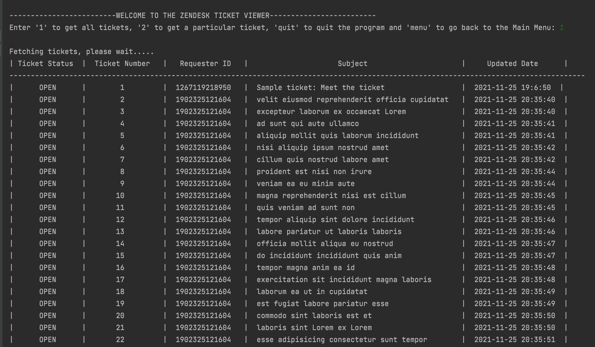
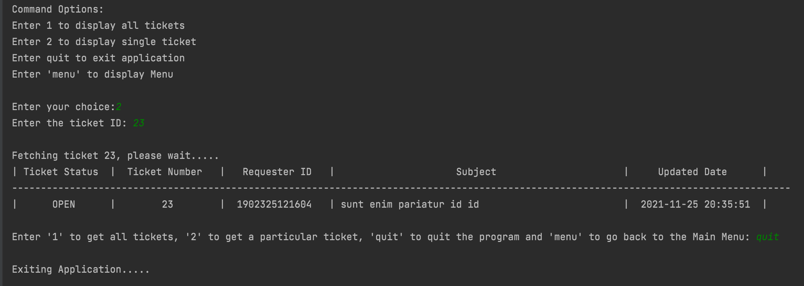

# Zendesk Ticket Viewer System

Created as part of Zendesk Coding Challenge for Summer Internship 2022

## Development environment

- Programming Language: Python 3.8.8

## Libraries used

- **sys**  - For using application packages
- **json** - For loading JSON data from file
- **requests** - For API access
- **math** - For rounding up page numbers
- **datetime** - For formatting dates
- **mock, unittest** - For testing

**NOTE**: Make sure all these libraries are installed. Otherwise the program would throw an error.

## Running the program

Clone the code from Github and import into PyCharm

### Code changes before running the programs
1. In `/src/credentials.text`, please provide subdomain, email, and password
2. In `/src/requesthandler.py`, on line 8, update with the complete location of **credentials.txt** as per your system 
3. In `/test/testCases.py`, on line 24 and line 32, update with the complete location of **testData.json** and **testDataComplete.json** respectively as per your system

### Running the Main Program
1. Open `main.py` under `/src` folder
2. Click on the play button to run the application

### Running the Test Cases
1. Open `testCases.py` under `/test` folder
2. Click on the play button to run the test cases

## Result

Output of Displaying All Tickets

---

Output of Displaying a ticket based on Ticket ID

